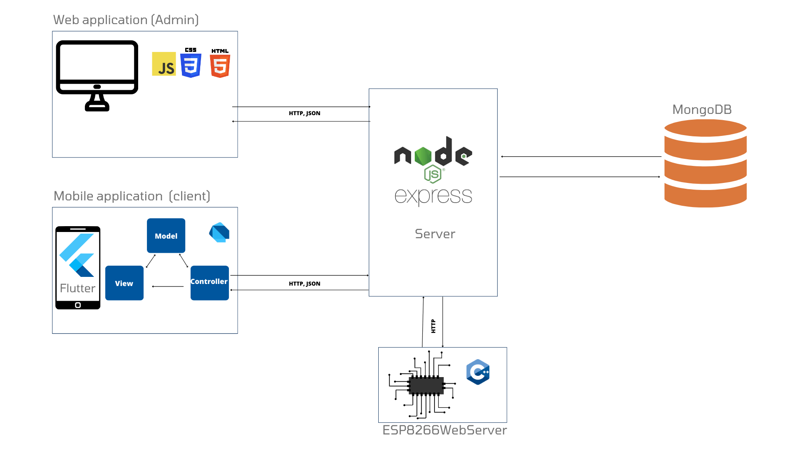

# Traffic Light Control System

This repository hosts the **Express.js** backend and frontend for managing and visualizing traffic lights across a city. The system connects to ESP32 modules installed at each traffic light to monitor and control their states.

## Global architecture Overview

The system consists of multiple components that communicate through HTTP and JSON, as illustrated below:

- **Web Application (Admin)**: Built with JavaScript, HTML, and CSS, allowing administrators to monitor and control traffic lights.
- **Mobile Application (Client)**: Developed in Flutter, providing users with a client interface for interacting with traffic lights.
- **Node (Express.js) Server**: Acts as the central hub, managing requests and storing traffic light data in MongoDB.
- **ESP8266 Web Server**: Handles communication with individual traffic lights, sending state data and receiving control commands from the Node server.

## Project Features

This project enables users to:
- View all traffic lights and monitor their states in real time.
- Change the light state and power each light on or off.
- Add new traffic lights, associating them with specific ESP32 devices.

## Screens

### Home Screen
The Home Screen displays all existing traffic lights, allowing users to:
- **Search** and view traffic lights across the city.
- **Monitor each light’s current state**, including the active color.
- **Change the state** and **power on/off** any traffic light.
- **View each traffic light’s location** on a map.

### Add Traffic Light Screen
The Add Traffic Light Screen allows users to register a new traffic light in the system, associating it with a specific ESP8266 device.

