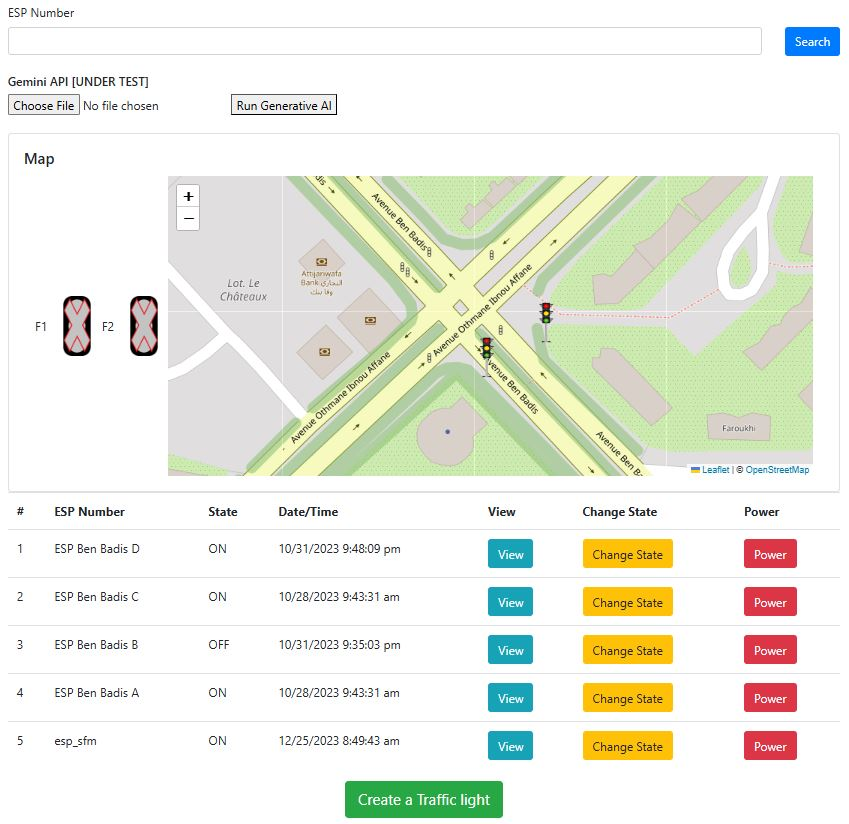
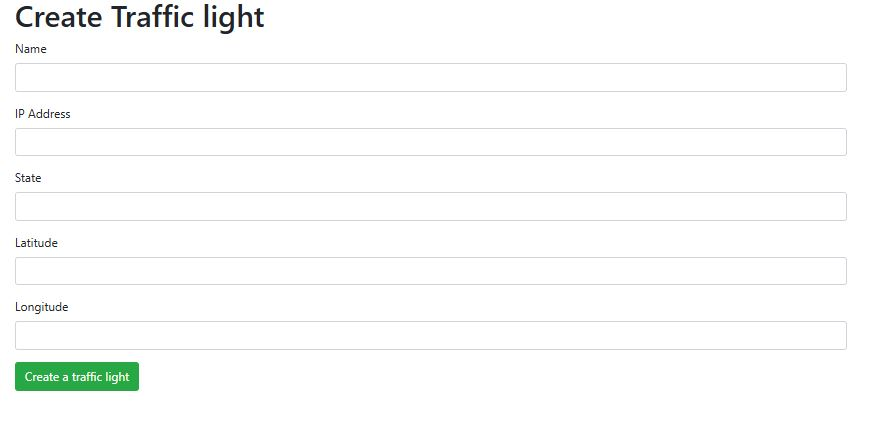

# Traffic Light Control System

This repository hosts the **Express.js** backend and frontend for managing and visualizing traffic lights across a city. The system connects to ESP32 modules installed at each traffic light to monitor and control their states.

## Project Overview

This project enables users to:
- View all traffic lights and monitor their states in real time.
- Change the light state and power each light on or off.
- Add new traffic lights, associating them with specific ESP32 devices.

The system includes:
- **Node (Express.js)** backend and frontend for traffic light management.
- **ESP32 (C++)** program to communicate with the Express server, sending traffic light statuses and receiving control commands.

## Features

### Screens

#### Home Screen
The Home Screen displays all existing traffic lights, allowing users to:
- **Search** and view traffic lights across the city.
- **Monitor each light’s current state**, including the active color.
- **Change the state** and **power on/off** any traffic light.
- **View each traffic light’s location** on a map.

#### Add Traffic Light Screen
The Add Traffic Light Screen allows users to register a new traffic light in the system, associating it with a specific ESP32 device.

